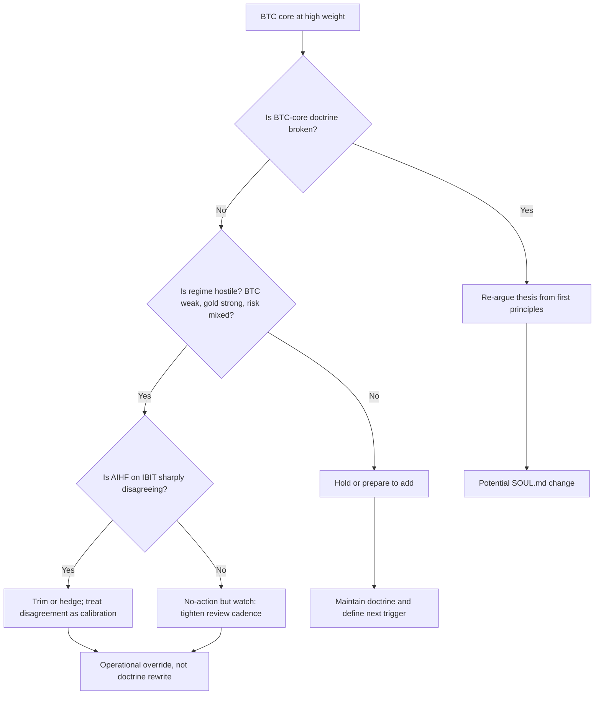

# BTC.md

BTC is not just another position in this repo. It is the core allocation, the benchmark that diversification must justify itself against, and the dominant source of portfolio-level regime risk when held at very high weight.

This document explains:

- why BTC is different from normal ticker research
- how BTC, IBIT, Hyperliquid, and Hypersurface fit together
- how to use Dexter and AIHF for a temporary BTC risk check
- when a BTC lesson belongs in `SOUL.md` and when it should stay operational

## Why BTC is different

Most equity positions in Dexter are judged as thesis expressions inside a diversified sleeve. BTC is different.

- **BTC is the core.** In this repo, HODLing Bitcoin is the base layer, not a tactical trade.
- **BTC is the main benchmark.** Diversification must beat BTC or clearly justify why it exists.
- **BTC is concentration risk.** At 80% of the global portfolio, the first question is not "is BTC a good business?" It is "is the current BTC concentration still appropriate for this regime?"
- **BTC is macro-sensitive.** Gold, liquidity, equity breadth, and the broader risk environment matter more than single-name-style second opinions.

That means BTC needs a dedicated **temp check** workflow, not just a generic ticker check.

## Global portfolio architecture

The repo's intended split is:

- **80% BTC core** = the center of gravity
- **10% tastytrade sleeve** = off-chain diversification engine
- **10% Hyperliquid sleeve** = on-chain diversification engine

The two sleeves are intentionally equal-sized. Their job is not to replace BTC. Their job is to justify their existence by trying to outperform **BTC**, **SPY**, and **GLD** over time.

Use fund AUM as operating context for sizing and rebalance math, but not as essay material unless explicitly requested.

When BTC or IBIT is 80% of the global book, the temp check must answer:

1. Is the BTC-core thesis still intact?
2. Is the current regime hostile enough that sizing should be reduced, hedged, or watched more closely?
3. Is AIHF seeing a proxy disagreement large enough to matter?
4. Is the correct response doctrinal, or merely operational?

## Venue split: BTC vs IBIT vs Hyperliquid vs Hypersurface

### BTC / Hypersurface

Use **BTC itself** as the real economic position.

- Core BTC lives in the global portfolio, not in the Hyperliquid equities sleeve.
- BTC options are primarily a **Hypersurface** workflow.
- When the repo talks about BTC puts or covered calls, the operational assumption is: Dexter gives advice, you execute on Hypersurface.

### IBIT / BITO / GBTC on tastytrade

Use **IBIT** (or BITO / GBTC) as a **proxy data source** or ETF execution path.

- For `/theta-btc-weekly`, IBIT is primarily a strike/probability proxy for BTC options advice.
- Do **not** treat `IBIT` as the doctrinal center of the BTC thesis.
- AIHF on `IBIT` is useful because AIHF reasons naturally about listed securities; it gives a machine-readable second opinion on a BTC proxy.
- Normal AIHF proxy fallback order is: `IBIT` -> `BITO` -> `GBTC`.
- If all listed proxies are unavailable as tickers, direct-crypto fallback is `BTC-USD`.
- Never use raw `BTC` as the AIHF ticker; it appears mis-mapped and can return nonsense pricing.
- `BTC-USD` remains the regime/doctrine ticker regardless of which AIHF ticker was used.

### Hyperliquid

Hyperliquid is **not** the place to redefine the BTC core.

- The Hyperliquid sleeve is for HIP-3 on-chain equities, commodities, and indices.
- BTC can still exist on Hyperliquid as a market or price source, but in this repo's architecture it is not the HIP-3 sleeve target.
- Do not blur "BTC core" with "Hyperliquid sleeve."

## What AIHF is for in BTC temp checks

AIHF should be treated as a **second system**, not the final authority.

For BTC-core checks, AIHF is useful for:

- proxy disagreement via `IBIT`
- detecting when the machine is strongly bearish while Dexter is structurally bullish
- forcing a sizing / timing conversation

AIHF is **not** sufficient on its own to answer:

- whether BTC should remain core doctrine
- whether 80% concentration is acceptable for current regime
- whether a gold-led safety regime warrants temporary defensive action

Best framing:

- **Dexter** = doctrine, regime, sizing judgment
- **AIHF on IBIT / BITO / GBTC** = preferred listed-proxy disagreement signal
- **AIHF on BTC-USD** = direct-crypto fallback when listed proxies fail as tickers
- **BTC temp check** = combined decision layer

## The BTC temp-check workflow

The temp check should combine doctrine, regime, concentration, and second-system disagreement.

### Inputs

Read:

1. `SOUL.md`
2. current heartbeat context via the `heartbeat` tool; if none is configured, fall back to `docs/HEARTBEAT.example.md`
3. fund config / AUM if available
4. current BTC / IBIT / proxy exposure context
5. recent benchmark moves:
   - `BTC`
   - `GLD`
   - `SPY`
6. AIHF proxy run on `IBIT`

Operational rule:

- missing heartbeat is normal; use example heartbeat guidance and continue
- missing fund config is also normal; continue, but mark the output as lower-confidence and scenario-based when live sizing context is unavailable

### Core questions

The temp check should answer:

1. **Doctrine** — Is the BTC-core thesis structurally intact?
2. **Regime** — Are BTC, gold, and equities signaling risk-on, risk-off, mixed, or BTC-specific stress?
3. **Concentration** — Is 80% BTC still within acceptable doctrine, or temporarily too large?
4. **Second-system disagreement** — Is AIHF on `IBIT` disagreeing in a way that should change sizing or only increase caution?
5. **Action** — What do we do now?

## Decision states

The output should end in one of these states:

- **hold** — keep BTC size unchanged; doctrine and regime are still aligned enough
- **trim** — reduce BTC exposure because concentration or regime makes current size too aggressive
- **hedge** — keep core BTC doctrine intact but add temporary downside protection
- **prepare to add** — thesis intact, regime stabilizing, better entry likely near
- **no-action but watch** — do nothing yet, but define the invalidation and next review trigger

## Decision model



## Suggested output format

Use this structure for manual or future automated BTC temp checks:

```markdown
---
title: "BTC Temp Check — YYYY-MM-DD"
artifact_type: btc_temp_check
publish_status: internal
---

# BTC Temp Check — YYYY-MM-DD

- Core exposure: 80% of global portfolio / assumed scenario weight
- Regime: one label, with qualifier when needed
- AIHF proxy (IBIT): bullish / bearish / mixed / unavailable
- Confidence: high / medium / medium-low / low
- Decision: hold / trim / hedge / prepare to add / no-action but watch

## Why
- BTC vs GLD vs SPY evidence with precise numbers
- concentration judgment
- AIHF disagreement summary

## Doctrine vs regime
- what is structural
- what is temporary

## Missing inputs / degraded mode
- heartbeat available or missing
- fund config available or missing
- AIHF available or unavailable
- live-weight aware or scenario-only

## Invalidation
- what would make this decision wrong

## Next review
- exact date or market trigger
```

The key requirement is that the output contains:

- one regime label
- one concentration judgment
- one second-system summary
- one action
- one confidence level
- one degraded-mode note when inputs are missing
- one invalidation

For the chat reply, do **not** print the full saved markdown artifact by default.

Return only:

- saved filename
- decision
- confidence
- one-line regime label
- one-line invalidation
- one-line next review

Only print the full artifact if the user explicitly asks for it.

## Regime rubric

Use a simple scoring rule instead of loose labels:

- `gold-led safety`: GLD outperforms both BTC and SPY in at least 2 of the 3 measured windows
- `btc-specific stress`: BTC underperforms both GLD and SPY in at least 2 of the 3 measured windows
- `risk-on`: BTC and SPY both outperform GLD in at least 2 of the 3 measured windows
- `risk-off`: BTC and SPY are both weak while GLD is relatively strongest in at least 2 of the 3 measured windows
- `mixed`: none of the above cleanly wins

If windows conflict, say so explicitly:

- `mixed, QTD defensive`
- `mixed, short-term bounce inside defensive quarter`

## Manual prompts to run today

### 1. AIHF proxy check on `IBIT`

Use a one-ticker AIHF run in Dexter:

```text
Use aihf_double_check action=run for one ticker only: IBIT.
Do not read PORTFOLIO.md.
Set default_included to [{"ticker":"IBIT","weight":100}], sleeve=default, top_n_included=1, analyst_preset=lean.
Return the second-opinion summary and saved filename.
```

### 2. BTC options strike advice for Hypersurface

Use:

- `/theta-btc-weekly`

This uses `IBIT` as the proxy data source and returns BTC-equivalent strike logic for Hypersurface.

### 3. Run the built-in temp check

Use:

- `/btc-temp-check`

Alias:

- `/btc`

This runs the dedicated skill, compares `BTC-USD`, `GLD`, `SPY`, and `IBIT`, uses AIHF on `IBIT` as a proxy disagreement signal, and saves `BTC-TEMP-CHECK-YYYY-MM-DD.md`.

### 4. Manual BTC temp-check prompt

If you want to run it manually instead of using the shortcut, use a prompt like this:

```text
Run a BTC temp check for the core portfolio.
Assume BTC / IBIT is 80% of the global portfolio.
Read SOUL.md and current heartbeat context first.
Assess BTC vs GLD vs SPY over 7d, 30d, and quarter-to-date.
Run AIHF second opinion on IBIT as a proxy input.
Then classify the result as hold, trim, hedge, prepare to add, or no-action but watch.
Distinguish doctrine from regime. Distinguish structure from timing.
End with one invalidation condition and one next review trigger.
```

## When to update `SOUL.md`

BTC temp checks should **not** rewrite doctrine every time BTC gets ugly.

Good reasons to update `SOUL.md`:

- a persistent BTC concentration rule becomes clearer
- a repeated gold / BTC regime signal proves durable enough to formalize
- a structural lesson about how BTC interacts with the rest of the portfolio becomes undeniable
- a second-system calibration rule around `IBIT` / BTC proxy disagreement becomes durable

Bad reasons to update `SOUL.md`:

- a one-week or one-month drawdown
- fear after a sharp move
- a single AIHF bearish read on `IBIT`
- a temporary macro wobble that belongs in operations, not doctrine

Use this rule:

- **`SOUL.md`** = structural BTC-core doctrine
- **temp check output** = temporary regime override
- **`HEARTBEAT.md`** = operational monitoring of BTC and gold signals

If a lesson is not strong enough to judge the next quarter against, it probably does not belong in `SOUL.md` yet.

## Current repo direction

`/btc-temp-check` is now the executable version of this workflow.

That shortcut should:

1. read `SOUL.md`
2. read current heartbeat and fund config
3. measure BTC / GLD / SPY regime
4. run AIHF on `IBIT`
5. return a decision, invalidation, and next review date

Use `BTC.md` as the doctrinal template and the saved temp-check artifacts as the operational record.

---

## Current cycle context (March 2026)

**The forecast.** The log-scale cycle model — built on twelve years of watching the same halving-driven pattern repeat — called BTC peaking above $150,000, with $157,580 as the precise log-scale projection. BTC hit $125,000. The call was structurally correct. The cycle is now in its correction phase.

**Current projection.** The same model that correctly called the 2025 top is now projecting a cycle bottom in the **$50,000–$60,000** range before the next halving-driven cycle begins. That is the intended accumulation zone for adding BTC core exposure.

**The miss.** At $125,000, the plan was to sell 50% of core BTC and redeploy in the $50-60K range. We were at the keyboard. The position was there. The conviction was there. CT was unanimous that this time was different. No single indicator on CoinGlass showed a confirmed top. In the absence of a clean signal — with everyone around screaming the four-year cycle was dead — we didn't pull the trigger. BTC has since written down roughly 50% from its peak. *[Full account: [The Machine Was Always Running](https://ikigaistudio.substack.com/p/the-machine-was-always-running)]*

**The lesson.** The miss was not about analysis. The cycle call was right. The miss was execution at the final inch — the specific friction between decision and action where CT consensus and the possibility of a cleaner entry create just enough resistance to prevent the trade. The antidote is not better analysis. It is pre-defined triggers that do not require a clean signal at the moment of execution. The machine should be set before the top, not decided at the top.

---

## The Hypersurface put strategy

The primary BTC accumulation mechanism during the correction phase is not buying spot at a discretionary target. It is selling secured puts on Hypersurface and letting the machine work while the cycle completes.

**Structure:**
- Collateral: USDT0 on HyperEVM, sourced from capital rotation (including SOL → BTC → bridge)
- Instrument: BTC secured puts on Hypersurface, highest-yield strike available
- Premium: approximately **$3,000/week** at recent rate (~158% APR at the $70,500 strike)
- Rollable: weekly, continuously, regardless of where BTC trades

**Why this is the right structure:**
1. If BTC stays above the strike, collect premium and roll. The machine generates ~$3,000/week on capital that would otherwise sit idle while waiting for a spot entry.
2. If BTC falls through the strike, get assigned long BTC below spot — which is exactly where we want to be given the cycle forecast. The accumulation at discount is the designed outcome.
3. The effective break-even drops by ~$3,000 every week regardless of price direction. The machine does the work while the cycle resolves.

**The missed cost.** Twelve weeks of inaction on this strategy = approximately $36,000 in foregone premium on a $200,000 collateral position. That is 30% of original capital, generated by a machine that was running for someone else the entire time. *The machine does not care where you bought your collateral. It cares that you put it to work.*

**Execution path:**
1. Bridge USDT0 collateral to HyperEVM
2. Open secured put at highest-yield BTC strike on Hypersurface
3. Roll weekly
4. If assigned: long BTC at effective cost basis = strike − accumulated premiums
5. Continue rolling the position or hold the assigned BTC, depending on where the cycle stands

**The break-even math.** At $3,000/week in premium income, and with a target BTC spot recovery to ~$116,000 for the original $200,000 position to be made whole: every week of running the machine reduces the recovery target by $3,000. The machine is not passive. It is actively rebuilding the position cost basis from the inside.

---

## The last-inch rule

The pattern that has cost the most across BTC, the HYPE airdrop window, and the Hypersurface premium months is identical: correct thesis, plan built, conviction present, execution at the final inch failed due to CT noise, absence at the wrong moment, or waiting for a cleaner entry that never arrives.

The resolution is not better analysis. It is:

1. **Pre-define triggers before the moment of execution**, not during it.
2. **Set the machine before the top** — weekly puts rolling, position in place — rather than deciding at the moment when CT is loudest.
3. **Treat absence from the keyboard as an execution risk**, not a neutral state. The HYPE airdrop required signing T&C during a specific window. We took a break. Gone.
4. **The machine was always running for someone else.** When we were not in the Hypersurface puts, someone else was collecting $3,000/week on the same collateral size. That is the real cost of waiting.

This is what VINCE exists to prevent: the machine should always be running. *[More: [The Machine Was Always Running](https://ikigaistudio.substack.com/p/the-machine-was-always-running)]*
