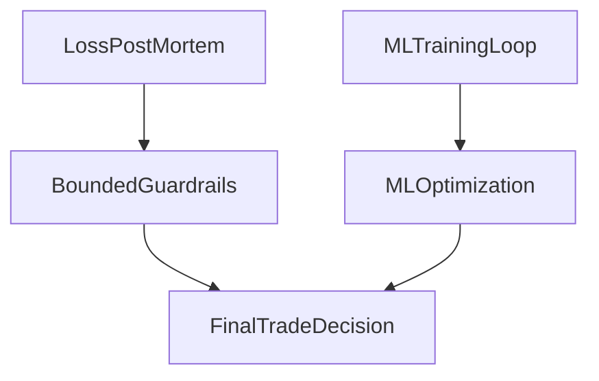

<div align="center">

# VINCE

```
  ██╗   ██╗██╗███╗   ██╗ ██████╗███████╗
  ██║   ██║██║████╗  ██║██╔════╝██╔════╝
  ██║   ██║██║██╔██╗ ██║██║     █████╗
  ╚██╗ ██╔╝██║██║╚██╗██║██║     ██╔══╝
   ╚████╔╝ ██║██║ ╚████║╚██████╗███████╗
    ╚═══╝  ╚═╝╚═╝  ╚═══╝ ╚═════╝╚══════╝
```

### _Push, not pull._

**Unified data intelligence** for options and perps, with a **self-improving paper trading bot** at the core — powered by [Dexter](README.md) as the thesis engine and the [AI Hedge Fund](https://github.com/eliza420ai-beep/ai-hedge-fund) as the research backend.

> **⚠️ Active refactor in progress.** The sections below document what VINCE is today. The [Refactor Goals](#refactor-goals) section immediately below describes where it is going. Read that first.

</div>

---

## Quick read (start here)

**What VINCE is:** a recursive trading intelligence terminal — paper bot signal research, onchain options assistant, self-improving overnight engine. Part of a three-repo stack with [Dexter](README.md) (thesis + BTC regime) and the [AI Hedge Fund](https://github.com/eliza420ai-beep/ai-hedge-fund) (18-analyst research backend).

**What v1 proved:** the recursive proof loop works. Feature store → ONNX models → causal gates → policy update → repeat. 1,200+ commits, ten agents, full attribution surface. The loop compounds. The surface was too wide.

**What v2 does:** strips to three agents, ships Forge overnight autoresearch, and repositions VINCE as the frontend terminal for the full stack.

| Keep | Move | Cut |
|------|------|-----|
| **Solus** — weekly Hypersurface options (core use case) | **Echo** → Dexter skill | Memes + NFT tracking |
| **Otaku** — reframed as ERC-8004 agent identity + x402 skills | **Kelly** → OpenClaw daemon | Polymarket / Oracle |
| **VINCE data agent** — perps data feed for Solus + Otaku | **Eliza** → Perplexity pipeline | Flywheel score |
| **Forge** — nightly MLX autoresearch, `causal_uplift × Sharpe` | **Clawterm + Sentinel** → Claude Code skills | Memetics tab |

**The operator stack:** Perplexity (research) → Claude Cowork (review + briefs) → OpenClaw (Kelly 24/7 daemon) + VINCE (trading terminal). Three machines. No overlap.

**Live execution:** spun out to a standalone repo. Two candidates — [`agent-cli`](https://github.com/eliza420ai-beep/agent-cli) (Python, REFLECT self-improvement, APEX orchestrator) or [`perp-cli`](https://github.com/eliza420ai-beep/perp-cli) (TypeScript, multi-DEX, CCTP V2). VINCE proves the signal; the execution repo trades it live.

→ [Refactor Goals](#refactor-goals) — full seven-goal breakdown  
→ [Agent-by-agent](#7--agent-by-agent-refactor-what-stays-what-moves-what-gets-rethought) — what happens to each of the ten agents  
→ [V1 Reference](#v1-reference-what-we-built) — what exists in the codebase today

---

## Refactor Goals

VINCE v1 proved the loop. VINCE v2 strips it to the core and rebuilds around the full Dexter + AIHF stack.

### 1 — Add MLX (top priority)

The single most important addition. Same overnight autoresearch ratchet that powers Dexter, applied to VINCE's own reasoning layer via **Forge**.

- Vendor [`autoresearch-mlx`](https://github.com/trevin-creator/autoresearch-mlx) into `src/tools/forge/`
- Forge mutates agent prompts, gate policies, swarm collaboration rules, and feature engineering logic
- Evaluation harness: VINCE's existing paper-bot replay engine
- Metric: `causal_uplift × Sharpe` (flywheel score removed with Kelly in Goal 2)
- Ratchet: git commit winners, revert losers — you wake up to tighter gates and a one-paragraph summary

```bash
# New env flag (add to .env.example)
FORGE_ENABLED=true
FORGE_RUNTIME=mlx            # or "python" for non-Apple-Silicon
FORGE_BUDGET_MINUTES=300     # 5-hour safe nightly window
FORGE_TARGET_METRIC=causal_uplift_sharpe
```

No cloud. No extra bills. 300–600 experiments/hour on M2/M3/M4 unified memory.

### 2 — Remove lifestyle (Kelly → OpenClaw + the Three Machines)

Kelly and `plugin-kelly` are **removed from the VINCE core**. This is not a demotion — it's Kelly finally running on the infrastructure it always deserved.

The argument is laid out cleanly in [The Three Machines](https://ikigaistudio.substack.com/p/the-three-machines) (ikigaistudio, Mar 2026): the operator stack that has emerged is three layers, not one.

| Machine | Role | Runs when |
|---------|------|-----------|
| **Perplexity** | Research layer — real-time search, source attribution, raw intelligence that feeds the thesis | Always |
| **Claude Cowork** | Decision layer — desktop operator, reviews system output, drafts briefs, executes multi-step tasks that need desktop context | Laptop open |
| **OpenClaw** | Execution layer — always-on background daemon, skills-based connectors, triggers and monitors 24/7 | Always, even when laptop is closed |

The insight the essay surfaces: the OpenClaw community has already built fragments of Kelly without knowing Kelly exists. A wine cellar skill that indexes 962 bottles from a CSV and answers natural language queries. An Oura Ring health assistant that cross-references biometrics with calendar. A grocery autopilot that navigates Tesco via browser control. A Home Assistant integration managing room air quality and a Roborock vacuum through conversation. Each one is a Kelly use case. Each one is a daemon running on $5/month on a server that never sleeps.

**This is exactly why Kelly belongs on OpenClaw, not inside a trading terminal.**

VINCE needs to be at your desk when it matters. Kelly needs to be running at 3 AM when you're not. Claude Cowork requires the laptop to be open — it can review the overnight trade post-mortem but it cannot send you a wine pairing suggestion while you're at the village market on Saturday. OpenClaw can. OpenClaw is the daemon that runs while you live the life the trading system is designed to protect.

**The full three-machine stack for our workflow:**

```
Perplexity
  └─ researches regime shifts, earnings, macro catalysts, sector outlook
  └─ feeds raw intelligence into Dexter's thesis layer and AIHF analyst context

Claude Cowork (desktop, laptop open)
  └─ reviews weekly Dexter attribution report
  └─ drafts SOUL.md thesis updates after quarterly review
  └─ interprets Forge's nightly summary and proposes policy mutations
  └─ runs post-mortems on losing VINCE trades

OpenClaw (always-on daemon, $5/month server)
  └─ Kelly skills: wine cellar, health protocols, travel, dining, fitness
  └─ VINCE monitoring: drift sentinel, budget breach alerts, Telegram pushes
  └─ Dexter triggers: weekly rebalance reminder, theta P&L push, SOUL.md validation
  └─ Forge watcher: pushes nightly "X experiments ran, Y committed" summary to Telegram
```

The moat is not the tool. Anyone can install OpenClaw. The moat is the skills — the AGENTS.md files that encode six months of live trading intelligence, Kelly's 1,200 knowledge files on wine and lifestyle, and the operational logic that ties them together. The infrastructure is identical for everyone. The judgment encoded in the instructions is not.

VINCE v2 has one job: trading intelligence. No lifestyle tab, no flywheel score dilution from non-trading signals, no Kelly in standups. Kelly moves to OpenClaw and gets better at being Kelly — running 24/7, connected to your calendar, your health data, your cellar, your grocery order, your home, your life.

### 3 — Remove memes and NFTs

All memes tracking, NFT floor data, and associated signal logic is removed. These surfaces had the worst signal-to-noise ratio and the highest maintenance cost. VINCE v2 focuses exclusively on:

- **Hypersurface options** — Solus (the core use case, gets all the focus)
- **Hyperliquid perps** — paper bot signal layer, feature store, ONNX proof harness
- **Onchain identity + DeFi** — Otaku, reframed around ERC-8004 (see Goal 7)

What is explicitly not in v2:
- No Polymarket / Oracle — failed to produce real edge, deprioritized (see Goal 7)
- No X sentiment in VINCE — Echo/x-researcher moves to Dexter as a thesis-layer skill (see Goal 7)
- No meme columns in the feature store, no NFT floor provider, no Memetics tab

### 4 — Rethink the frontend: serve Dexter + AIHF data

The biggest architectural change. VINCE v2 is not a standalone intelligence — it is the **terminal frontend** for the full three-repo stack.

| Data source | What VINCE surfaces |
|-------------|----------------------|
| **Dexter** | BTC regime, SOUL.md thesis state, option theta P&L, weekly rebalance signal, quarterly attribution |
| **AI Hedge Fund** | 18-analyst conviction scores, AIHF challenge results, `/double-check` output, Sharpe autoresearch deltas |
| **VINCE itself** | Solus options positions + Brier calibration, paper bot signal quality, ONNX model health, feature store depth, Otaku ERC-8004 reputation score |

The leaderboard becomes a unified dashboard across all three repos. The daily standup gains AIHF and Dexter rows. Forge's nightly summary surfaces alongside the Solus options P&L.

### 5 — SOUL.md as a user-facing config primitive

VINCE v2 ships with a clear onboarding path that lets any user replace our thesis with their own in one file.

```
SOUL.md                  ← your thesis (BTC-core, gold-core, equity-only, whatever)
  └─ Dexter reads it     ← builds portfolio sleeves from your conviction
  └─ AIHF reads it       ← 18 agents challenge your thesis, not a generic one
  └─ Forge reads it      ← overnight experiments optimize for your metric, not ours
```

The `SOUL.md` format is documented, versioned, and validated on startup. If a key field is missing, Dexter tells you exactly what to fill in. The goal: a new user can express their investment thesis in plain English, run `bun start`, and have the full stack — paper bot, AIHF challenge, Forge overnight run — operating on their conviction by the next morning.

### 6 — Spin out live execution: choose an execution layer starter

> **Open decision.** The execution layer will be a standalone repo. The architectural cut is clear. The starter choice is not yet final. Two strong candidates, both forked into the org.

VINCE's paper trading bot has excellent signal logic — feature store, ONNX models, causal proof gates, regime profiles, Kelly sizing, VinceBench scoring. That logic is worth keeping. But **the use case of actually executing trades on Hyperliquid deserves its own repo**, and we should not try to bolt production execution onto an ElizaOS frontend that was never designed for it.

#### Option A — [agent-cli](https://github.com/eliza420ai-beep/agent-cli) (Python · forked from Nunchi-trade)

| Strength | Detail |
|----------|--------|
| **Strategy depth** | 14 strategies: `engine_mm`, `avellaneda_mm`, `regime_mm`, APEX orchestrator, Guard trailing stop, Radar scanner, Pulse detector |
| **REFLECT self-improvement** | Nightly loop — reads trade history, auto-adjusts APEX parameters (radar threshold, confidence gates, daily loss limit) with guardrail bounds. Execution-layer equivalent of Forge |
| **APEX orchestrator** | Manages 2–3 concurrent slots, composes Radar + Pulse + Guard, proven on testnet |
| **MCP server** | 16 tools via Model Context Protocol: `radar_run`, `apex_run`, `reflect_run`, `trade`, `status` — callable from Dexter, VINCE, Claude |
| **OpenClaw deployment** | One-click Railway deploy, Telegram bot, reads `AGENTS.md` + `SOUL.md` to define trading behavior |
| **Skills standard** | Each capability (Onboard, APEX, Radar, Pulse, Guard, REFLECT) ships as `SKILL.md` installable into OpenClaw, Claude Code, or Dexter |
| **Weakness** | Python (different stack from VINCE/Dexter TypeScript). HL-only — no multi-DEX. |

#### Option B — [perp-cli](https://github.com/eliza420ai-beep/perp-cli) (TypeScript · forked from hypurrquant)

| Strength | Detail |
|----------|--------|
| **Language match** | TypeScript + ESM — same stack as VINCE and Dexter. No context switch |
| **Multi-DEX** | Pacifica (Solana) + Hyperliquid (HyperEVM) + Lighter (Ethereum) from one CLI |
| **Cross-chain bridge** | CCTP V2 — $0 fee USDC bridging across Solana, Arbitrum, Base (6 routes) |
| **Funding rate arb** | Cross-exchange scanner + auto-executor: `perp arb auto --min-spread 30` |
| **AI agent mode** | Every command supports `--json` with consistent envelope + error codes. `perp api-spec --json` for full discovery. Composite plans for multi-step atomic operations |
| **Claude Code skill** | `npx skills add hypurrquant/perp-cli` — universal installer for Claude Code, Cursor, Codex |
| **Test coverage** | 860+ tests |
| **Weakness** | No REFLECT-style self-improvement loop. No APEX orchestrator. Grid/DCA bots but less sophisticated strategy composition than agent-cli. |

#### Side-by-side

| Criterion | agent-cli | perp-cli |
|-----------|-----------|----------|
| Language | Python | **TypeScript** ✓ |
| Exchanges | HL only | **Pacifica + HL + Lighter** ✓ |
| Strategy depth | **14 strategies + APEX** ✓ | Grid, DCA, arb bots |
| Self-improvement | **REFLECT auto-tune** ✓ | None |
| MCP integration | **16 tools, full MCP server** ✓ | `--json` + composite plans |
| OpenClaw deploy | **One-click Railway + Telegram** ✓ | Claude Code skill |
| SOUL.md aware | **Yes** ✓ | No |
| Cross-chain bridge | No | **CCTP V2, $0 fee** ✓ |
| Tests | ~263 | **860+** ✓ |

#### The architectural cut either way

Regardless of which starter wins, the division of labor is identical:

| Layer | Repo | Job |
|-------|------|-----|
| Signal research | VINCE (this repo) | Feature store, ONNX, causal proof, regime detection, VinceBench |
| Thesis + conviction | [Dexter](README.md) | SOUL.md, BTC regime, AIHF challenge, quarterly attribution |
| Live execution | agent-cli **or** perp-cli | Order placement, position management, real PnL |

And the proof-then-execute loop is the same:

```
VINCE proves the signal is real (paper bot, causal gates, ONNX)
  → execution repo trades it live
  → real trade outcomes feed back to VINCE feature store
  → VINCE retrains on live outcomes
  → loop
```

**Current lean:** agent-cli if the priority is self-improving strategy orchestration (REFLECT + APEX + SOUL.md awareness + OpenClaw); perp-cli if the priority is multi-DEX reach, TypeScript consistency, and clean AI agent I/O (`--json` everywhere). The two are not mutually exclusive — perp-cli as the low-level multi-DEX execution primitive, agent-cli as the orchestration + self-improvement layer on top of it, is a viable hybrid.

### 7 — Agent-by-agent refactor: what stays, what moves, what gets rethought

Each of VINCE's ten agents gets re-evaluated against a single question: **is this the right home for this intelligence?**

---

#### Solus — stays, gets all the focus

The one agent in VINCE v2 that earns its keep without debate. Solus assists with the weekly onchain options strategy on Hypersurface — strike ritual, optimal strike selection, assignment probability (GBM + ML), Brier calibration, tail risk, portfolio copula, Friday resolve reminder. This is the core, recurring, high-stakes use case that VINCE exists to serve. Every refactor decision should be evaluated against whether it makes Solus sharper. If an agent, plugin, or feature dilutes focus away from Solus, it should be cut or moved.

---

#### Echo / plugin-x-researcher → move to Dexter as a skill

The X research logic — BTC long-term sentiment signal, clawterm day report, source ranking, machine-readable payload for downstream agents — has real value. But it belongs in Dexter, not VINCE. Dexter is where thesis-level signals live. BTC sentiment is a thesis input, not a perps trading input. The clean move: extract the core `x-research` skill and add it to Dexter's skill registry, where it feeds directly into SOUL.md validation, regime checks, and quarterly thesis audits. The plugin-x-researcher infrastructure in VINCE gets removed.

---

#### Oracle (Polymarket) — honest failure, deprioritize

We have not gotten real insights from Oracle. The latency arb engine and Kelly-sized paper trades look good on paper but have never produced actionable edge in practice. The Polymarket CLOB data is noisy, the implied probability math requires cleaner order flow than we have, and the causal proof for multi-agent treatment on prediction markets has not materialized. Oracle stays in the codebase as a low-maintenance stub but gets zero active development in VINCE v2. If the Polymarket angle is worth revisiting, it belongs in the AIHF research backend — not in a perps-focused terminal.

---

#### Clawterm + Sentinel → move to skills for Claude Code / Codex

Both agents exist to help us as developers — Clawterm for OpenClaw skills/terminal guidance, Sentinel for ops, cost tracking, ONNX health, PRDs, and repo improvements. This is exactly the use case that Claude Code and Codex are built for. As VINCE plugins they add overhead and consume context. As skills loaded into Claude Code or Codex they run natively in the environment where the development work actually happens. The move: extract both into standalone `SKILL.md` files (following the agent skills standard), remove the plugins from VINCE v2, and install them into the Claude Code / Codex workspace.

---

#### Eliza (knowledge research) → hand off to Perplexity

Eliza's core job in VINCE was extending the knowledge base — 1,200+ files built through research sessions, document ingestion, and structured knowledge encoding. That was valuable. But Perplexity is the right machine for this. It searches in real time, cites sources, synthesizes current information, and hands off clean research to Claude for writing and reasoning. Eliza as a knowledge-ingestion agent inside VINCE is a manual, fragile substitute for what Perplexity does natively and better. The VINCE knowledge base becomes a Perplexity → Claude Cowork → commit pipeline. Eliza as a plugin gets removed. The 1,200 knowledge files stay.

---

#### Otaku — keep, but reframe around ERC-8004 agent identity

Otaku was the only agent with a wallet — Morpho, CDP, Bankr, Biconomy, Clanker, DefiLlama, execution graduation L0→L3. The onchain execution angle is worth preserving. But the framing needs to update.

The more interesting experiment is to use Otaku as a showcase for what we believe is the future of NFTs — not collectibles, but **agent identity and on-chain reputation**. The argument is laid out in [The Decade-Long Bet](https://ikigaistudio.substack.com/p/the-decade-long-bet) and [The Primitive Is Alive](https://ikigaistudio.substack.com/p/the-primitive-is-alive): ERC-721 failed as a collectible vehicle because collectibles have no cash flows. ERC-8004 — the same primitive applied to AI agent identity — succeeds because agent identity has cash flows. Every time an agent's skill is queried, revenue accrues to the NFT holder. The token is not a JPEG. It is a business license, a reputation record, and a revenue stream.

The structural parallel to our 2017 IP certificate thesis is exact: in 2017 the token carried a photographer's provenance, authorship, and rights metadata. In 2026 the token carries the agent's identity, track record, and skill endpoints. The entity changed. The architecture didn't.

Otaku in VINCE v2 becomes the agent that:
- Registers VINCE's own agent identity on ERC-8004 (Identity Registry)
- Accumulates on-chain reputation from real Solus prediction scores (Reputation Registry)
- Exposes VINCE's signal quality skill as an x402 endpoint — callable by other agents, paid per query
- Demonstrates execution graduation as it earns trust (L0 → L3) through a verifiable on-chain track record rather than internal flags

This is not a peripheral experiment. This is the proof-of-concept for the thesis: autonomous agents need permissionless, verifiable, portable identity and reputation because they cannot build trust through social networks, legal systems, or word of mouth. We have the data (Brier scores, ONNX calibration curves, six months of predictions) to make this real.

---

#### Summary table

| Agent | VINCE v2 status | New home (if moved) |
|-------|----------------|---------------------|
| **Solus** | ✅ Core focus | — |
| **Otaku** | ✅ Reframed → ERC-8004 identity + x402 skills | — |
| **Echo / x-researcher** | ➡️ Move | Dexter skill |
| **Clawterm** | ➡️ Move | Claude Code / Codex skill |
| **Sentinel** | ➡️ Move | Claude Code / Codex skill |
| **Eliza** | ➡️ Hand off | Perplexity → Cowork pipeline |
| **Oracle** | ⏸️ Stub, no dev | AIHF if revisited |
| **Kelly** | ➡️ Move (Goal 2) | OpenClaw daemon |
| **Naval** | 🔲 Evaluate | Philosophy → Dexter SOUL.md review? |
| **VINCE (data agent)** | ✅ Core perps data feed | — |

---

## V1 Reference: What We Built

> Everything below this line documents **VINCE v1** — what exists in the codebase today. It is preserved as historical context and as the foundation for the v2 refactor. Treat it as a reference, not a roadmap. Where v1 content contradicts the Refactor Goals above, the goals win.

### What VINCE v1 is

Markets are now an AI-vs-AI game. The edge is not a one-off model. The edge is a loop that compounds.

VINCE v1 ran that loop end to end across ten agents:

**research → decision → trade → attribution → retraining → policy update**

Every decision was explained before risk was taken. Every outcome was written back into the system. Every cycle updated how the next decision was made.

The core proof: a machine that learns from its own behavior and only scales when proof is strong. The v2 refactor does not discard this — it strips it to the agents and surfaces where the loop actually worked, and rebuilds around those.

### V1 build state: Recursive + ML proof loop

- **Recursion pillar**: raise closed-outcome sufficiency, spread closes across distinct days, and improve regime balance so the allocator can move beyond observe-only with clean evidence.
- **ML pillar**: keep model/runtime health strong and preserve signal quality discipline while we collect better training data.
- **1+1=3 Synergy pillar**: prove multi-agent treatment beats ONNX-only baseline with positive uplift, promotion-eligible causal confidence, and minimum per-arm depth.
- **Operator rhythm**: use Coverage Velocity deltas (`closes`, `days`, `regime`, `stage`, `pair`, `min-arm`) to run a daily proof-coverage sprint until blockers clear.

This phase is about repeatable, auditable improvement. Scores should rise because the system gets better under strict criteria.

### Why we push ML + recursion this hard (VINCE-specific)

In VINCE, **ML** and **recursion** are not two buzzwords. They are two different jobs in one proof system.

- **ML is the optimizer**: ONNX models score signal quality, adjust size, and shape exits from real closed outcomes.
- **Recursion is the governor**: each cycle writes outcomes back, checks sufficiency/causal gates, then decides whether policy and capital can move.
- **Together they prevent two failure modes**:
  - ML-only drift: model gets "better" on paper but ignores risk discipline.
  - Rules-only stagnation: process is stable but stops adapting when market microstructure changes.

For our Hyperliquid perps paper bot, the loop is concrete:

`signal -> gate -> paper trade -> close outcome -> attribution -> feature store -> train -> ONNX deploy -> next gate`

If any link breaks, the loop does not compound.

### Why proving `1+1=3` is hard (and why it should be hard)

`1+1=3` means: **multi-agent treatment beats ONNX-only baseline with causal evidence**, not just a lucky week.

In our stack, that proof must pass all of this at once:

1. **Positive treatment uplift**: `onnx_plus_swarm` must outperform `onnx_enabled` on avg PnL.
2. **Causal promotion gate**: pair-level lower-bound effect must clear threshold (ciLower gate), not just point estimate.
3. **Per-arm depth**: each causal pair needs minimum sample depth per arm (no shallow wins).
4. **Safety integrity**: fewer execution mistakes (sizing blowups, regime mismatch, budget breaches) while uplift improves.

Why this is difficult for VINCE specifically:

- **Stage coupling problem**: improving one stage can starve another stage of depth, which delays causal eligibility.
- **Market regime churn**: perps behavior shifts quickly; edge seen in one regime can vanish in the next.
- **Small-N in the right buckets**: total trades can look fine while the exact pair/regime buckets needed for proof are still thin.
- **Guardrail drag is intentional**: when treatment edge weakens, we block or downsize. That slows data collection but protects quality.
- **No threshold games allowed**: we do bounded threshold alignment, but score gains must come from better outcomes, not easier gates.

This is why the Synergy pillar can stay blocked even with visible activity: the bar is designed to reject weak or noisy "wins."  
We only promote when uplift, confidence, depth, and safety all agree.

### Operator playbook: move Synergy from blocked to on-track

Run this daily, in order. Do not skip steps.

1. **Check treatment gate telemetry first**
   - Target: rising pass rate, positive `avg edge`, shrinking `depth deficit`.
   - If pass rate is low and edge is flat/negative, do not loosen risk; fix treatment quality first.
2. **Close depth deficits where they are largest**
   - Fill the biggest stage/pair deficits until minimum per-arm depth is met.
   - Goal: remove `causal_sample_depth_below_target`.
3. **Protect uplift while collecting samples**
   - Keep swarm edge positive with execution discipline (avoid repeated sizing/stop mistakes).
   - Goal: remove `swarm_not_beating_single_agent`.
4. **Re-check causal eligibility**
   - Confirm promotion reasons are shrinking and ci-lower quality is improving.
   - Goal: remove `causal_promotion_not_eligible`.
5. **Promote only on sustained proof**
   - Milestones: `upliftDelta > 0`, `promotionEligible=true`, `minSamplesPerArm>=target`, `synergyScore>=50` then `>=75` over the 7d window.
   - If budget breaches or uplift quality worsen, roll back threshold tweaks and prioritize safety.

**Daily standup prompt (copy/paste)**

```
Synergy daily check:
1) Treatment gate telemetry: pass rate, avg edge, depth deficit.
2) Top stage/pair deficits to close today (exact counts).
3) Uplift status vs ONNX baseline and main blockers.
4) Causal promotion status + failing pair reasons.
5) Execution-risk check: budget breaches, sizing/stop errors, regime mismatches.
6) Today's actions (max 3), owner, and expected metric impact by tomorrow.
```

### Structural thesis: crypto, AI, and what to own

In fast markets, signal half-life is short and distribution is crowded.  
What holds value is owning the full learning stack:

1. **Own the data exhaust** — your fills, misses, timing, regime context, and source lineage.
2. **Own the decision policy** — explicit gates, capital rules, and rollback paths that survive stress.
3. **Own the recursive ML loop** — retraining from live outcomes, not static backtests.

If you own all three, your system compounds intelligence while others re-run prompts.

### 15 phases were delivery milestones, not the story

The phase map shows how we shipped the machine:

- **Phases 1–4** — Shared scorecards and regime-aware gates.
- **Phases 5–9** — Trade attribution and self-improvement from outcomes.
- **Phases 10–12** — Guardrails, policy-as-code, and rollback drills.
- **Phase 13** — Multi-agent consensus and reliability weighting.
- **Phases 14–15** — Sufficiency + causal confidence gates for risk promotion.

### What you get today

- **Proof-gated allocator** — risk scales only when causal and sufficiency checks pass.
- **Full attribution surface** — each decision is traceable to sources, confidence, and realized outcome.
- **Continuous retraining loop** — trades feed features, models update, policies adapt.
- **Operator control under stress** — staged rollout (observe → recommend → guarded auto) with rollback ready.

### Read more (detailed docs)

- Detailed phase-by-phase overview: [PHASES_1_15_DETAILED.md](docs/PHASES_1_15_DETAILED.md)
- Phase 14 PRD: [PRD_PHASE_14_PROOF_TO_CAPITAL_ENGINE.md](docs/standup/prds/PRD_PHASE_14_PROOF_TO_CAPITAL_ENGINE.md)
- Phase 15 operational runbook: [PHASE_15_7DAY_RUNBOOK.md](docs/standup/prds/PHASE_15_7DAY_RUNBOOK.md)

### Prior releases (v1 milestones)

Earlier versions shipped: the paper bot ML loop (feature store, ONNX, VinceBench), HIP-3 spot tokens alongside Hyperliquid perps, the Polymarket edge engine (three strategies, Kelly-sized — later determined not to produce real edge), zero AI slop across all ten agents, the leaderboard with cost transparency, and the content flywheel (Eliza publishing real results to Substack). These releases proved the recursive proof loop. V2 strips to what works and rebuilds around it.

---

## Why

Modern markets are machine-speed. Human-only workflows are not enough.

For decades, investors could win with access, judgment, and patience. That edge shrank as information latency collapsed.

Now, information is repriced in milliseconds. If your process depends on manual interpretation and manual execution, you are late by default.

The durable edge today is code: repeatable process, broad coverage, and zero emotional drift.

Renaissance's Medallion is the clearest proof point: roughly 39% annualized since the late 1980s, about 2x the S&P 500 over the same era. It closed to outside capital in 1993 because extra size would dilute edge. Berkshire's audited long-run record is roughly 19.9% annualized in the same period.

Medallion won by repeating small statistical edges across many instruments with discipline. Humans can track a handful of positions. Code can monitor thousands, react in milliseconds, and execute the same playbook without fatigue.

### The foundations

Three breakthroughs between 1952 and 1973 made automation inevitable:

1. **1952** — Harry Markowitz proved portfolio construction could be mathematical.
2. **1964** — William Sharpe introduced CAPM: a way to measure risk, compare returns to a benchmark, and quantify performance.
3. **1973** — Fischer Black and Myron Scholes published the Black-Scholes equation for pricing options, replacing human estimation with formulas.

To automate investing, you need clear inputs, measurable outputs, rules that do not depend on judgment calls, and formulas that adapt with data. Black-Scholes delivered that framework.

Edward Thorp proved these ideas in live markets at Princeton/Newport. Jim Simons scaled them at Renaissance.

### Five levels of autonomous investing

| Level | Name | Edge |
| :--- | :--- | :--- |
| **1** | Manual | Information scarcity. Who you knew, what you believed, whether you had the conviction to act. |
| **2** | Algorithmic | Pre-defined rules execute automatically. Speed and discipline, no learning. |
| **3** | Automated | Integrated workflows: data feeds, portfolio models, execution. Reduced friction, no intelligence added. |
| **4** | Autonomous | ML models that update on new data without explicit reprogramming. |
| **5** | Agentic AI | Plans, chooses actions, uses tools, monitors outcomes, and self-corrects across multi-step workflows. |

### Where VINCE sits

VINCE v1 was built at **Level 5** — ten agents researching, analyzing, paper-trading, evaluating outcomes, and improving their own models. The paper bot trained in production, wrote to the feature store, and deployed ONNX models back into the decision loop.

VINCE v2 targets the same level with a tighter surface: Solus as the human-readable weekly workflow, Forge as the overnight self-improvement engine, Otaku as the on-chain identity layer, and the paper bot as the causal proof harness. The loop is the same. The agent count is not.

The move from Level 1 to Level 5 is not anti-human. It is pro-process. Advantage moved from information access to integrated research, risk, and execution that runs 24/7. Goal: stay in the game without living on screens. Push, not pull.

---

## The Team

V1 had ten agents in clear lanes. V2 is a smaller, sharper squad — see the full agent-by-agent breakdown in [Goal 7](#7--agent-by-agent-refactor-what-stays-what-moves-what-gets-rethought).

| Agent | V1 lane | V2 verdict |
| :--- | :--- | :--- |
| **Solus** | Hypersurface options: strike ritual, assignment prob (GBM + ML), Brier calibration, tail risk, copula | ✅ **Core focus** — stays, gets all resources |
| **Otaku** | Only agent with a wallet. Morpho, CDP, Bankr, execution graduation L0→L3 | ✅ **Reframed** — ERC-8004 identity + x402 skills |
| **VINCE** | Objective data: perps, memes, news, paper bot, 15+ signal sources | ✅ **Core perps data feed** — scoped to perps + options |
| **ECHO** | CT sentiment, X research, BTC long-term sentiment signal | ➡️ **Move** — Dexter skill (thesis input, not perps input) |
| **Clawterm** | AI agents terminal: OpenClaw skills, setup tips, trending | ➡️ **Move** — Claude Code / Codex skill |
| **Sentinel** | Ops, cost steward, ONNX health, PRDs, repo improvements | ➡️ **Move** — Claude Code / Codex skill |
| **Eliza** | Knowledge research, Substack content, 1,200+ knowledge files | ➡️ **Hand off** — Perplexity → Claude Cowork pipeline |
| **Oracle** | Polymarket discovery, latency arb, Kelly-sized paper trades | ⏸️ **Stub** — failed to produce real edge; no active dev |
| **Kelly** | Lifestyle concierge: wine, dining, travel, health, flywheel score | ➡️ **Move** — OpenClaw daemon (see Goal 2) |
| **Naval** | Philosophy, mental models, standup conclusions | 🔲 **Evaluate** — possible → Dexter SOUL.md review layer |

One conversation, ask any teammate by name; standups 2x/day. [MULTI_AGENT.md](docs/MULTI_AGENT.md)

---

### Trading Bot: No Tilt. Every decision explained. Every outcome learned.

The paper bot runs 24/7 on the **Leaderboard** (Trading Bot tab): 15+ signal sources, 38 onchain assets (crypto, stocks, commodities, indices) as Hyperliquid perps. Zero tilt. Every open position shows strength, confidence, sources, and R:R; every close feeds the feature store and ML loop. Goal progress ($420/day, $10K/mo), open positions, recent trades, and signal source status — all in one place. No chat required. [LEADERBOARD.md](docs/LEADERBOARD.md)

**HIP-3 assets** (stocks, commodities, indices on Hyperliquid) are capped at 5x leverage in code; max leverage can be read from the Hyperliquid API when available. New HIP-3 markets are **discovered automatically**: a daily task scans all HIP-3 DEXes, keeps symbols with 24h volume above threshold, and adds new candidates (e.g. RIVN) to [targetAssets.ts](src/plugins/plugin-vince/src/constants/targetAssets.ts) so the bot can trade them. **Beware of low liquidity, high volatility, and increased liquidation risk** on HIP-3 perps (same notice as on Hyperliquid).

---

### Polymarket: paper trading that proves the edge

> **V2 note:** Oracle is deprioritized in v2. The latency arb engine and Kelly-sized paper trades never produced actionable edge in practice. The Polymarket CLOB data is noisy, the implied probability math requires cleaner order flow than we have, and the causal proof for multi-agent treatment on prediction markets never materialized. Oracle stays as a stub but gets zero active development. If the Polymarket angle is worth revisiting, it belongs in the AIHF research backend — not in a perps-focused terminal.

*(V1 description below)*

When spot moves, prediction markets often lag. Oracle ran a **latency arb engine**: Binance spot and Polymarket CLOB in real time, implied probability from the option-like payoff of binary contracts, edge above a threshold, Kelly-sized paper trades. No execution by default — only logs and learns. The goal was to show that the edge is real before a single dollar is at risk.

---

### Solus: Hypersurface options assistant that learns from its own calls

Solus is the **CFO agent** for weekly options on Hypersurface (BTC, ETH, SOL, HYPE). One ask: "optimal strike for BTC" or "strike ritual" and you get a strike call with **assignment probability** (GBM closed-form, or ML-calibrated when the ONNX model is trained on your resolved predictions). No copy/paste: options context is cached and refreshed every 10 minutes, and VINCE's Deribit data flows in automatically.

Solus **measures itself**. Every strike call can auto-record a prediction; at expiry you resolve ("we got assigned" / "we didn't"). Brier score over resolved predictions measures calibration. That score and the last 10 outcomes are injected into every optimal-strike and position-assess prompt — so Solus sees its own track record and tempers confidence when it's been wrong. A Friday reminder nags you to resolve open predictions; a daily task writes calibration notes (e.g. Brier by asset, by IV bucket) into context. When you have 50+ resolved rows, a recurring task trains an ONNX assignment calibrator and the options context switches to ML-calibrated P(assign) for best CC/CSP strikes.

**Tail risk** (e.g. P(spot down 15% in 7d) per asset) and **portfolio assignment risk** (when you have 2+ positions: joint P(at least one assigned), P(all), P(none) via Gaussian copula) are in the same context. No Python subprocess, no new APIs — TypeScript-only on top of existing Deribit data. The quant skill in `skills/quant/` is the reference narrative and math; Solus ships the same ideas in plugin-solus. [docs/SOLUS.md](docs/SOLUS.md) · [plugin-solus/FEATURE-STORE.md](src/plugins/plugin-solus/FEATURE-STORE.md) · [IMPROVEMENT_PROOF.md](src/plugins/plugin-solus/IMPROVEMENT_PROOF.md)

---

## TL;DR

### V1 (what exists today)

VINCE v1 pushes daily market intel (options, perps, memes, DeFi) to Discord and Slack across ten agents. One command, **ALOHA**, gives the full read: vibe check + PERPS + OPTIONS + "trade today?". A self-evolving paper bot runs underneath — ML loop, feature store, ONNX deployment, strategy genome, regime profiles, portfolio construction, execution graduation. Kelly handles lifestyle (wine, dining, travel, health, flywheel score). Every losing trade triggers a multi-agent post-mortem.

### V2 (where this is going)

VINCE v2 is a focused trading intelligence terminal — not a ten-agent lifestyle platform.

**Three agents. One thesis. One proof system.**

- **Solus** runs the weekly onchain options strategy on Hypersurface. Strike ritual, assignment probability (GBM + ML Brier calibration), tail risk, portfolio copula. This is the weekly high-stakes workflow VINCE was always built to serve.
- **Otaku** carries VINCE's on-chain identity — ERC-8004 registration, reputation from real Solus Brier scores, x402 skill endpoints. The proof-of-concept for the thesis that autonomous agents need verifiable, portable identity.
- **VINCE (data agent)** feeds Solus and Otaku with perps data from Dexter and AIHF research outputs. Scoped to perps + options. No memes. No Polymarket. No lifestyle.

**Forge** runs overnight on Apple Silicon, mutating agent prompts and gate policies against the paper bot replay engine. Every morning: a commit of winners, a revert of losers, a one-paragraph summary. `causal_uplift × Sharpe` is the only score that matters.

Everything else — Echo, Clawterm, Sentinel, Eliza, Oracle, Kelly, Naval — moves to the right machine (Dexter, Claude Code, Perplexity, OpenClaw) or is cut.

---

## Getting Started

```bash
bun install
cp .env.example .env   # add API keys
bun run build

elizaos dev            # hot-reload
# or
bun start              # production (Postgres when POSTGRES_URL set)
```

**Web UI:** `bun start` serves the API on port 3000 and the frontend on **5173**. Open http://localhost:5173 for chat and dashboard.

---

## Features

> V2 status noted for each feature. Items marked ~~strikethrough~~ are removed or moved in the v2 refactor.

**Core (stays in v2)**
- **Solus (Hypersurface)** — Strike ritual + optimal strike + assignment probability (GBM with optional ML). Brier calibration, auto-record, Friday resolve reminder, tail risk, and portfolio copula. Recursive learning. ✅ Core focus. [SOLUS.md](docs/SOLUS.md)
- **Self-evolving paper bot** — End-to-end loop from signal to trade to feature store to training to ONNX deployment. Four models: signal quality, position sizing, TP optimizer, SL optimizer. Rule-based fallbacks keep it live when models are missing. ✅ Signal research layer only (live execution spun out).
- **Forge (v2 addition)** — Overnight autoresearch on Apple Silicon. Mutates agent prompts and gate policies against the paper bot replay engine. `causal_uplift × Sharpe` metric. ✅ New in v2.
- **Otaku / ERC-8004 identity** — Reframed: agent identity registry, on-chain reputation from Solus Brier scores, x402 skill endpoints. ✅ Reframed in v2.
- **ALOHA** — One command: vibe check + PERPS + OPTIONS + "trade today?" ✅ Scoped to perps + options (memes removed).
- **Strategy genome** — 15+ parameters mutate weekly, replay on history, and auto-promote the winner by Sharpe and drawdown. ✅ Stays.
- **Portfolio construction** — Correlation matrix, heat caps, Kelly sizing, and opportunity-cost checks. ✅ Stays.
- **Multi-agent** — Standups 2x/day. One thread, remaining team. ✅ Scoped to Solus + Otaku + VINCE data agent.

**Regime profiles** — *V2 note: Oracle regime and Echo sentiment inputs are removed (Oracle deprioritized, Echo moves to Dexter). V2 regime detection draws from Dexter's BTC regime + AIHF conviction scores.*

**Moving to other machines (not in v2)**
- ~~**Kelly**~~ — ➡️ Moves to OpenClaw daemon (see Goal 2).
- ~~**Flywheel score**~~ — ➡️ Removed with Kelly. Non-trading signals dilute the metric.
- ~~**X research (plugin-x-research / Echo)**~~ — ➡️ Moves to Dexter as a thesis-layer skill (see Goal 7).
- ~~**Knowledge ingestion (Eliza)**~~ — ➡️ Hands off to Perplexity → Claude Cowork pipeline (see Goal 7).
- ~~**Clawterm / Sentinel**~~ — ➡️ Move to Claude Code / Codex as skills (see Goal 7).

**Deprioritized (stub only)**
- ~~**Polymarket / Oracle**~~ — ⏸️ Latency arb engine and Kelly-sized paper trades never produced real edge. Remains in codebase as a low-maintenance stub; no active development (see Goal 7 for full post-mortem).
- ~~**Leaderboard: Memetics + Digital Art tabs**~~ — ⏸️ Removed. Memes and NFT floor data had worst signal-to-noise and highest maintenance cost.
- ~~**Proof & next (Eliza Substack + X output)**~~ — ⏸️ Handed off to Perplexity machine.

---

## Paper Bot & ML

The 12-phase roadmap built this loop; the algo (gates, open/skip, feature store) and the ML pipeline (train → ONNX → report → Sentinel) are documented in [PRD: Paper Trading Algo and ML](docs/standup/prds/PRD_PAPER_TRADING_ALGO_AND_ML.md) and [PRD: ML Training Pipeline](docs/standup/prds/PRD_ML_TRAINING_PIPELINE.md). Signals flow into trades, trades flow into the feature store, the feature store feeds Python training, and ONNX models deploy back to the bot. Four models: signal quality, position sizing, TP optimizer, SL optimizer. When models are missing, **rule-based fallbacks** keep it running (e.g. 60% signal-quality threshold, 0.5–2× position size). The dashboard's "100 trades processed" is the **Weight Bandit** (Thompson Sampling) count of **closed** trades; ONNX stays "None loaded" until you run training and place the `.onnx` files (and `training_metadata.json`) in `.elizadb/vince-paper-bot/models/` (or the configured models dir).

**VinceBench** scores every closed trade on process quality (signal, risk, timing, regime). The score trains the signal-quality model to learn more from high-quality decisions.

### Recent improvements (v1)

> V2 note: Sentinel improvement tasks (below) are being moved to Claude Code / Codex as a skill in v2. The paper bot remains as the causal proof harness, but live execution will be handled by the standalone execution repo (see Goal 6).

- **ONNX export fixed** — Graph and node I/O are renamed to `input`/`output` so onnxruntime loads models reliably; smoke tests run after every export so you see "ONNX smoke test passed" for all four models.
- **Env tuning** — No code changes needed to adjust trade frequency or size: ML threshold, swarm confidence, aggressive margin/size (see table below).
- **Training pipeline** — Sentinel improvement tasks write to `docs/standup/openclaw-queue/` with safe filenames (slashes in feature names no longer break writes). Feature prep uses a single concat for derived columns to avoid DataFrame fragmentation warnings.
- **Paper bot** — Size is capped to the bucket max before the policy check so high-notional assets open at cap instead of being blocked; funnel log includes rejection reasons (e.g. no_primary_signal, sentiment_gate_long, swarm_min_confidence) for tuning visibility. CoinGlass connection test is retried with backoff before falling back to Binance free APIs.

### Paper bot tuning (env)

Tune no-trades vs margin/size without code changes. In `.env` (see `.env.example`):

| Env var | Purpose |
|--------|--------|
| `VINCE_ML_SIGNAL_QUALITY_THRESHOLD` | 0–1. Override ML signal-quality threshold; lower = more trades (e.g. `0.5` when rule-based 60% is too strict). |
| `VINCE_SWARM_ENABLED` | `true` / `false`. Enable swarm consensus gating in the trade loop. |
| `VINCE_SWARM_MIN_CONFIDENCE` | 0–1 (default `0.5`). Min swarm consensus to allow a trade; lower = more trades. |
| `VINCE_AGGRESSIVE_MARGIN_USD` | Fixed margin per trade in aggressive mode (default `1000`). Increase for larger paper size. |
| `VINCE_AGGRESSIVE_BASE_SIZE_PCT` | Base size as % of portfolio when portfolio < margin (default `12`). |
| `VINCE_PAPER_MAX_SINGLE_TRADE_USD` | Paper bucket + policy cap per trade (default `10000`). High-notional assets (e.g. BTC, index products) often hit this; increase or leave unset to use default. |

**Single-trade cap:** The paper bucket and policy rule **max-single-trade-usd** cap each trade at **$10k** by default (see [policies/trading-policy.yaml](policies/trading-policy.yaml) and the paper bucket in [vinceCapitalBuckets.service.ts](src/plugins/plugin-vince/src/services/vinceCapitalBuckets.service.ts), or `capital-buckets.json` when present). If you see "blocked by policy engine: max-single-trade-usd" in logs, the requested size exceeded this cap; set `VINCE_PAPER_MAX_SINGLE_TRADE_USD` to raise it.

Many "no trade" outcomes come from ML quality below threshold, X sentiment not meeting 40% or neutral, confidence/strength below min, or swarm consensus below the min. Use these vars to relax gates for more paper volume or raise margin/size when you want larger positions. If you see many rejections for "ML quality below threshold 60%" and ONNX is not loaded, set `VINCE_ML_SIGNAL_QUALITY_THRESHOLD=0.5` (or 0.45) to allow more trades with rule-based scores.

The **strategy genome** adds a second improvement loop: every week, the genome mutates 15+ parameters, replays against historical feature-store data, ranks variants by Sharpe ratio and max drawdown, and promotes the winner. Regime profiles shift the genome's risk limits and sizing multipliers based on the current market personality.

### Re-run training

```bash
bun run train-models -- --bench-score-weight
```

Or with recency weighting: `bun run train-models:recency`. Output goes to `.elizadb/vince-paper-bot/models/` by default; **restart the agent** so the inference service loads the new ONNX and `training_metadata.json` (and the suggested threshold and suggested_tuning). Optionally run `VINCE_APPLY_IMPROVEMENT_WEIGHTS=true bun run improvement-weights` to update aggregator source weights from the report.

### Recursive improvement loop (autopilot)

The paper bot can **run on autopilot** so it keeps getting better from its own trades:

1. **Trade** → outcomes (open/close, PnL, strength, confidence) are written to the feature store.
2. **Task `TRAIN_ONNX_WHEN_READY`** runs every 12h; when there are **90+ complete trades**, it runs `train_models.py` (at most once per 24h).
3. **New ONNX models** and `training_metadata.json` (threshold, suggested_tuning, holdout_metrics) are written; on Cloud the task uploads to Supabase and calls `reloadModels()` so new models apply without restart.
4. **Optional:** Set `VINCE_APPLY_IMPROVEMENT_WEIGHTS=true` so the task **applies source weights** from the improvement report after each successful training run. No extra script — weights update automatically and the next evaluation cycle uses them.
5. **Next cycle** uses updated thresholds, TP/SL from ONNX, and (if applied) updated aggregator weights → more/better data → repeat.

So: **trades → features → train → new models + weights → better decisions → more trades** is a **recursive loop** that runs without manual steps once the agent is up and the env flag is set.

### ML loop vs post-mortem loop (simple)

Both loops are recursive, but they do different jobs:

- **ML loop = performance engine.** It learns from many trades and predicts better signal quality, size, and TP/SL behavior.
- **Post-mortem loop = safety engine.** It learns from losses and applies bounded guardrails (for example: lower leverage cap, minimum stop-vs-ATR floor), then validates and rolls back if results do not improve.

Think of it this way:

- ML says: "Within our rules, what is the best move?"
- Post-mortem policy says: "What mistakes are temporarily off-limits until proven safe again?"

They are **complementary**, not conflicting, because of precedence:

1. Hard risk limits and policy guardrails (including post-mortem candidate overlays)
2. Policy engine checks (block/warn/size-reduce)
3. ML optimization inside those limits

This avoids double-counting risk while still allowing ML to improve decisions. If a post-mortem policy hurts outcomes, the candidate is rolled back automatically.



### Validate ML improvement

After training, validate that ML-derived thresholds (min strength / min confidence) would have improved selectivity on historical data:

```bash
bun run validate-ml
```

Or directly:

```bash
python3 src/plugins/plugin-vince/scripts/validate_ml_improvement.py \
  --data .elizadb/vince-paper-bot/features
```

The script loads the same feature-store data, computes suggested tuning (Q0.25 of profitable trades), and reports baseline win rate vs filtered win rate and % of skipped trades that were losers.

**Example run (Feb 2026, 158 closed trades):**

| Metric | Value |
|--------|--------|
| Total trades with outcome | 158 |
| Baseline win rate (all trades) | 23.4% (37 wins) |
| Suggested tuning (Q0.25 profitable) | min_strength=56, min_confidence=50 |
| If we had used suggested_tuning | 121 trades taken (20.7% win rate), 37 skipped (68% of skipped were losers) |
| Result | On this dataset, suggested_tuning did not improve win rate (filtered 20.7% vs baseline 23.4%). Small samples or weak strength/confidence signal; re-run after more trades. |

Conclusion: the ML logic can adjust parameters from data; improvement on live data depends on regime and data quality. Re-run after more closed trades.

---

## North Star

You never have to "chat" with VINCE. He pings you. Proactive agent: day report (ALOHA), trades and reasoning, close results and PnL. Chat remains for deep dives. Stay in the game without 12+ hours on screens.

---

## Scripts

| Script | Purpose |
| :--- | :--- |
| `elizaos dev` | Hot-reload development |
| `bun start` | Production start |
| `bun run deploy:cloud` | Deploy to Eliza Cloud |
| `bun run sync:supabase` | Backfill features to Supabase |
| `bun run db:check` | Verify DB migrations |
| `bun run train-models` | Train ML models (min 90 closed trades) |
| `bun run train-models:recency` | Train with recency decay (upweight recent trades) |
| `bun run improvement-weights` | Apply improvement report source weights (set `VINCE_APPLY_IMPROVEMENT_WEIGHTS=true` to apply) |
| `bun run validate-ml` | Validate ML thresholds on feature-store data |
| `bun run type-check` | TypeScript check (no emit) |
| `bun run check-all` | type-check + format + tests |

---

<div align="center">

_Built with [ElizaOS](https://github.com/elizaos/eliza). No hype. No permission. No exit._

</div>
