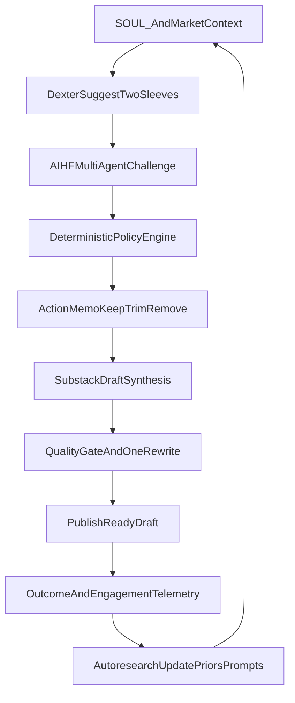

# PRD: Dexter North Star System (Thesis -> Challenge -> Policy -> Publish -> Learn)

**Version:** 1.0  
**Status:** Draft  
**Last Updated:** 2026-03-09

---

## 1. Executive Summary

Define Dexter's north-star operating system as a closed loop:

1. Build thesis-aligned two-sleeve portfolios from `SOUL.md`
2. Challenge every position with AIHF's multi-agent committee
3. Convert disagreement into deterministic policy actions (`keep`, `trim`, `remove`, `add_watch`)
4. Publish reasoning as high-quality Substack drafts
5. Learn from realized outcomes and engagement to improve priors/prompts/policy

Default mode is **advisory-only**. Optional execution pathways are defined but disabled by default behind explicit feature flags and approval gates.

---

## 2. North Star Objective

- Build a system that improves **research judgment**, not only output formatting.
- Make thesis decisions legible:
  - what to own
  - what not to own
  - what changed after independent challenge
- Produce publication-quality outputs that reflect the decision process.
- Close the loop with measurable learning from outcomes.

---

## 3. Scope Boundaries

| In scope | Out of scope |
|----------|---------------|
| Two-sleeve construction + AIHF challenge + policy memo | Replacing Dexter with AIHF as primary portfolio constructor |
| Deterministic advisory policy actions | Uncontrolled autonomous order execution |
| Substack-quality draft pipeline with quality gates | Direct publishing to Substack API in v1 |
| Feedback loop with proposal-based updates | Self-modifying prompts/policy without approval |
| Optional guarded execution path (feature-flagged) | Execution enabled by default |

---

## 4. End-to-End Architecture



---

## 5. Deterministic Policy Engine Specification

### 5.1 Inputs

Per ticker:

- `ticker`
- `sleeve`: `default | hyperliquid`
- Dexter state:
  - target weight
  - conviction tier/layer
  - inclusion/exclusion reason
- AIHF state:
  - PM stance/action
  - PM confidence
  - normalized score
  - conflict severity
  - analyst disagreement metadata (counts, key dissent)
- Regime/thesis tags:
  - risk-on/risk-off
  - theme match/mismatch

### 5.2 Outputs

```json
{
  "ticker": "AAPL",
  "action": "trim",
  "magnitude_pct": 3.0,
  "reason": "AIHF short 0.92 confidence; thesis-fit degraded under current regime.",
  "policy_confidence": 0.81,
  "requires_human_approval": true
}
```

Action enum:

- `keep`
- `trim`
- `remove`
- `add_watch`

### 5.3 Deterministic Threshold Table (v1)

| Condition | Action | Magnitude rule | Approval |
|-----------|--------|----------------|----------|
| No conflict, thesis intact | `keep` | 0% | No |
| Moderate conflict (`score <= -0.30` and AIHF >= 70%) | `trim` | 1-5% by confidence band | Yes |
| High conflict (`score <= -0.50` and AIHF >= 85%) | `remove` | full exit target | Yes |
| Excluded but bullish (`score >= 0.50` and AIHF >= 70%) | `add_watch` | 0% (watchlist only) | No |

Notes:

- Table is versioned (`policy_version`) and stored in config history.
- Rule evaluation must be pure/deterministic for replayability.

### 5.4 Safety and Governance

- Policy output cannot mutate live portfolios by default.
- Any action affecting portfolio targets requires explicit human approval.
- Optional execution mode requires all of:
  - feature flag enabled
  - per-broker execution flag enabled
  - explicit per-action user confirmation

---

## 6. Publication Pipeline Contract

### 6.1 Required Input Priority

1. `QUARTERLY-REPORT-YYYY-QN.md` (or HL variant for HL essay mode)
2. latest `AIHF-DOUBLE-CHECK-YYYY-MM-DD.md`
3. `SOUL.md` / `SOUL-HL.md`

Fallback behavior:

- Missing quarterly report -> fail fast with remediation
- Missing AIHF report -> continue with "validation unavailable" section
- Missing SOUL override -> use bundled fallback

### 6.2 Draft Quality Gates

Before final save:

- required sections:
  - Hook
  - Thesis map
  - Committee challenge
  - Decision layer
  - Risk + invalidation
- at least 3 concrete numeric claims in first 500 words
- total word count between 2,000 and 5,000
- no placeholders (`[TODO]`, `TBD`, `insert chart`)

If gates fail:

- perform one and only one rewrite pass
- re-check gates
- if still failing, save with explicit unresolved checklist note

### 6.3 Save Format Contract

Filename:

- `ESSAY-DRAFT-YYYY-QN.md`
- `ESSAY-DRAFT-HL-YYYY-QN.md` for HL-first mode

Required frontmatter:

```yaml
---
title: "<short declarative title>"
subtitle: "<specific falsifiable claim>"
tags:
  - ai
  - investing
  - portfolio
  - markets
thesis_bullet: "<single line thesis>"
publish_status: draft
---
```

### 6.4 Publication SLO Targets

- >= 95% of draft runs produce a saved markdown file
- >= 90% pass all quality gates after at most one rewrite
- p95 draft generation end-to-end latency < 180s (excluding external outages)

---

## 7. Autoresearch Loop Design

### 7.1 Telemetry Schema

Store to `.dexter` history with linked IDs:

- suggestion metadata:
  - timestamp, period, sleeve compositions, exclusions
- challenge metadata:
  - AIHF agreement %, conflicts, excluded-interesting
- policy metadata:
  - per-ticker action outputs, policy version, approvals
- publication metadata:
  - draft quality score, publish status, word count, numeric claim count
- outcome metadata:
  - realized returns by ticker/sleeve/period
  - benchmark deltas
  - post-publication engagement snapshots (manual or imported)

### 7.2 Reward Model (v1)

Composite reward `R` per cycle:

- `R_performance`: outperformance vs BTC/SPY/GLD benchmark set
- `R_policy`: quality of policy actions vs realized outcomes
- `R_quality`: draft quality-gate pass score
- `R_engagement`: normalized post-publication engagement

`R = w1*R_performance + w2*R_policy + w3*R_quality + w4*R_engagement`

Weights are config-driven and versioned.

### 7.3 Update Workflow (Proposal-Based)

No direct self-modification:

1. evaluator computes reward and identifies weak spots
2. emits **proposal artifacts**:
   - prompt/prior change proposal
   - policy threshold change proposal
3. user reviews proposals
4. approved proposals are applied in controlled commits/config updates

---

## 8. Operational Reliability and Fallbacks

| Failure | Expected behavior |
|---------|-------------------|
| AIHF unavailable/timeout | Continue advisory flow with explicit "validation unavailable" note; no blocking of draft generation |
| Missing portfolio artifacts | Fail fast with exact remediation (`/suggest`, `/suggest-hl`, `/quarterly`) |
| Partial AIHF ticker coverage | Mark report as partial and list unvalidated tickers |
| Quality gates fail twice | Save draft with unresolved checklist section |
| Telemetry write failure | Non-fatal warning; continue user-facing output |

---

## 9. Testing Strategy

### 9.1 Unit

- deterministic rule evaluation for policy engine
- threshold boundary tests for each action class
- quality gate validators
- telemetry schema validation

### 9.2 Integration

- suggestion -> AIHF -> policy -> memo path
- full draft pipeline with one rewrite pass
- fallback behavior under AIHF-down and missing-file scenarios

### 9.3 Replay/Backtest

- replay prior quarters with frozen policy versions
- compare policy decisions against realized outcomes
- verify reward model stability across windows

---

## 10. Phased Roadmap

### P0: Stabilize Advisory Pipeline

- complete logging and artifact integrity
- enforce input contracts and fallback messages

### P1: Deterministic Policy Engine

- ship pure rule evaluator
- append action memo every run
- add approval-gate wiring for portfolio mutations

### P2: Publication Reliability

- quality gate enforcement + one rewrite pass
- publish-ready frontmatter and naming
- draft SLO instrumentation

### P3: Autoresearch Evaluator

- telemetry linker + reward scorer
- proposal artifacts for prompt/policy updates
- review/approval workflow

### P4: Optional Guarded Execution

- feature-flagged execution mode
- per-broker guardrails and mandatory confirmation
- audit logs for every attempted execution action

---

## 11. Success Metrics

| Area | Metric |
|------|--------|
| System reliability | Double-check + draft pipeline completion rate |
| Research quality | Conflict calibration accuracy over subsequent periods |
| Portfolio outcomes | Outperformance vs benchmark set |
| Publication quality | % drafts passing gates first pass / after rewrite |
| Learning loop | # approved improvement proposals and realized gain deltas |

---

## 12. Dependencies and References

- AIHF integration: [`/Users/macbookpro16/Documents/research-stocks/dexter/src/tools/aihf/aihf-double-check-tool.ts`](/Users/macbookpro16/Documents/research-stocks/dexter/src/tools/aihf/aihf-double-check-tool.ts)
- AIHF feedback history: [`/Users/macbookpro16/Documents/research-stocks/dexter/src/tools/aihf/feedback.ts`](/Users/macbookpro16/Documents/research-stocks/dexter/src/tools/aihf/feedback.ts)
- Report persistence + essay metadata: [`/Users/macbookpro16/Documents/research-stocks/dexter/src/tools/report/report-tool.ts`](/Users/macbookpro16/Documents/research-stocks/dexter/src/tools/report/report-tool.ts)
- Essay synthesis workflow: [`/Users/macbookpro16/Documents/research-stocks/dexter/src/skills/essay-synthesis/SKILL.md`](/Users/macbookpro16/Documents/research-stocks/dexter/src/skills/essay-synthesis/SKILL.md)
- CLI orchestration shortcuts: [`/Users/macbookpro16/Documents/research-stocks/dexter/src/cli.ts`](/Users/macbookpro16/Documents/research-stocks/dexter/src/cli.ts)
- Prompt-level behavior policy: [`/Users/macbookpro16/Documents/research-stocks/dexter/src/agent/prompts.ts`](/Users/macbookpro16/Documents/research-stocks/dexter/src/agent/prompts.ts)
- Reference style PRD: [`/Users/macbookpro16/Documents/research-stocks/dexter/docs/PRD-AIHF-DOUBLE-CHECK.md`](/Users/macbookpro16/Documents/research-stocks/dexter/docs/PRD-AIHF-DOUBLE-CHECK.md)

---

## 13. Acceptance Criteria

- [ ] North-star architecture documented with a closed-loop flow
- [ ] Deterministic policy contract defined with explicit thresholds/actions
- [ ] Advisory-first + guarded execution mode boundaries are explicit
- [ ] Publication quality contract and SLOs are specified
- [ ] Autoresearch telemetry, reward model, and proposal workflow are defined
- [ ] Failure modes and test strategy are included
- [ ] Phased roadmap (P0-P4) is actionable and sequenced
